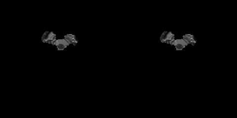

# 3D U-Net Convolution Neural Network with Keras
<br />
Left: grouth truth, right: prediction 
## Tutorial using BRATS Data
### Training
1. Download the BRATS 2018 dataset on the [BRATS 2018 competition page](https://www.med.upenn.edu/sbia/brats2018/registration.html).
Place the unzipped folders in the
```brats/data/BRATS2018``` folder.
2. Install Python 3 and dependencies: 
```
nibabel,
keras==2.2.4,
pytables,
nilearn,
SimpleITK,
nipype
```

3. Install [ANTs N4BiasFieldCorrection](https://github.com/stnava/ANTs/releases) and add the location of the ANTs 
binaries to the PATH environmental variable.

4. Add the repository directory to the ```PYTHONPATH``` system variable:
```
$ export PYTHONPATH=${PWD}:$PYTHONPATH
```
5. Convert the data to nifti format and perform image wise normalization and correction:

cd into the brats subdirectory:
```
$ cd brats
```
Import the conversion function and run the preprocessing:
```
$ python
>>> from preprocess import convert_brats_data
>>> convert_brats_data("data/BRATS2018", "data/BRATS2018_preprocessed_main")
```
6. Run the training:

To run training using the original UNet model:
```
$ python train.py
```
### Write prediction images from the validation data
In the training above, part of the data was held out for validation purposes. 
To write the predicted label maps to file:
```
$ python predict.py
```
The predictions will be written in the ```prediction``` folder along with the input data and ground truth labels for 
comparison.

### Results from Isensee et al. 2017 model
I trained a [model](unet3d/model/isensee2017.py) with the architecture as described in the [2017 BRATS proceedings
](https://www.cbica.upenn.edu/sbia/Spyridon.Bakas/MICCAI_BraTS/MICCAI_BraTS_2017_proceedings_shortPapers.pdf) 
on page 100. This [architecture](doc/isensee2017.png) employs a number of changes to the basic UNet including an 
[equally weighted dice coefficient](unet3d/metrics.py#L17), 
[residual weights](https://wiki.tum.de/display/lfdv/Deep+Residual+Networks), 
and [deep supervision](https://arxiv.org/pdf/1409.5185.pdf). 
This network was trained using the whole images rather than patches. 
As the results below show, this network performed much better than the original UNet. 


## Citations
GBM Data Citation:
 * Spyridon Bakas, Hamed Akbari, Aristeidis Sotiras, Michel Bilello, Martin Rozycki, Justin Kirby, John Freymann, Keyvan Farahani, and Christos Davatzikos. (2017) Segmentation Labels and Radiomic Features for the Pre-operative Scans of the TCGA-GBM collection. The Cancer Imaging Archive. https://doi.org/10.7937/K9/TCIA.2017.KLXWJJ1Q

LGG Data Citation:
 * Spyridon Bakas, Hamed Akbari, Aristeidis Sotiras, Michel Bilello, Martin Rozycki, Justin Kirby, John Freymann, Keyvan Farahani, and Christos Davatzikos. (2017) Segmentation Labels and Radiomic Features for the Pre-operative Scans of the TCGA-LGG collection. The Cancer Imaging Archive. https://doi.org/10.7937/K9/TCIA.2017.GJQ7R0EF
